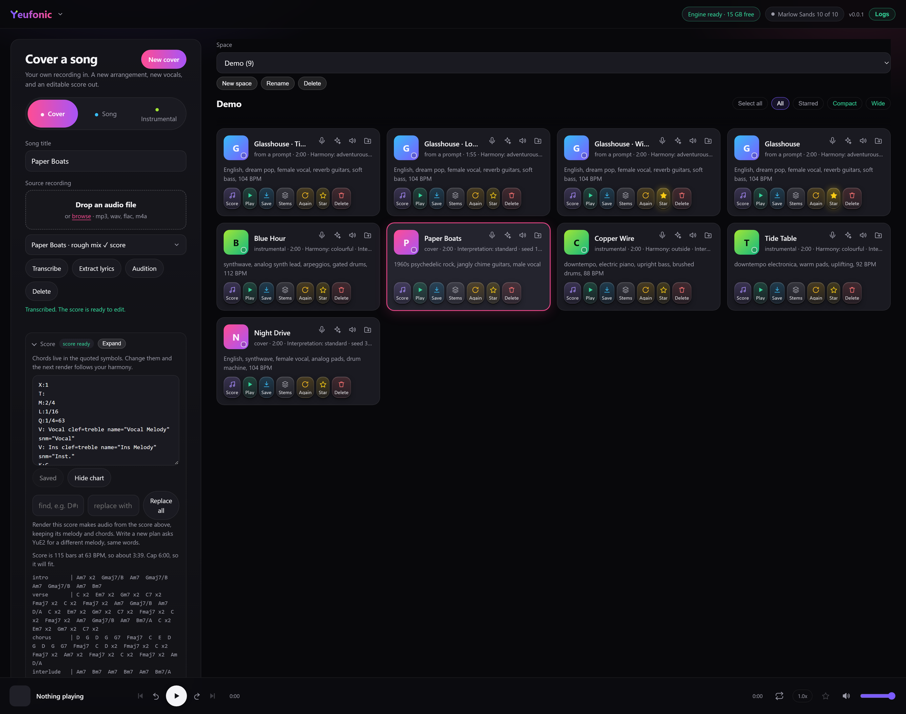
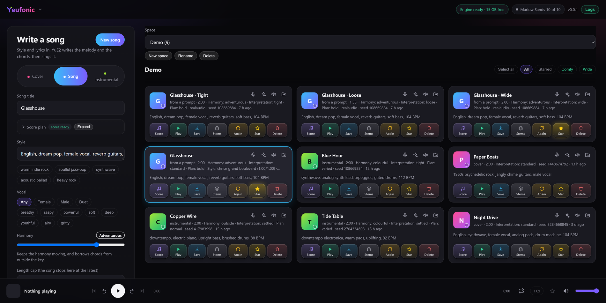
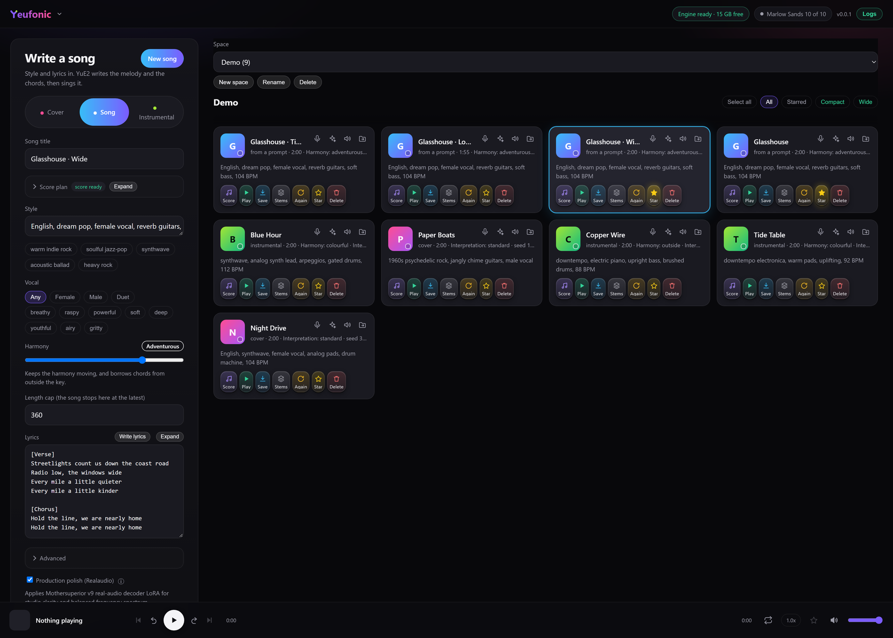
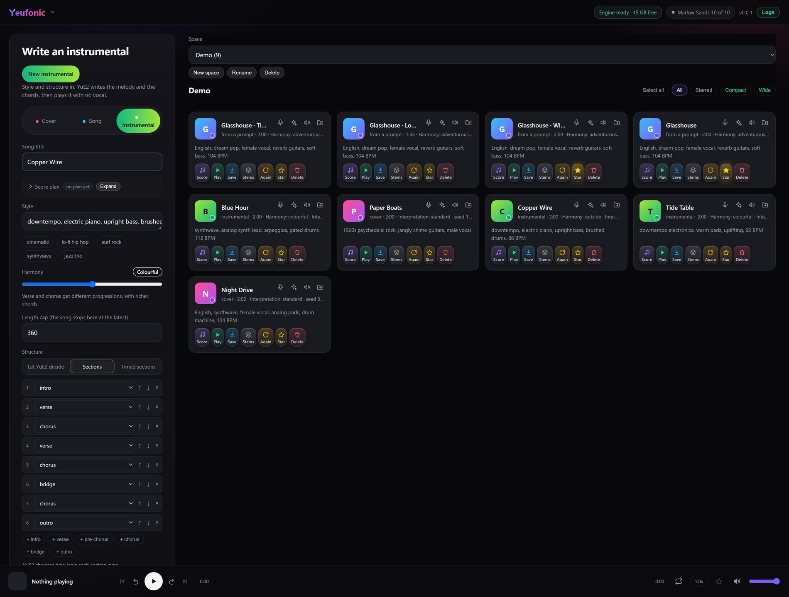
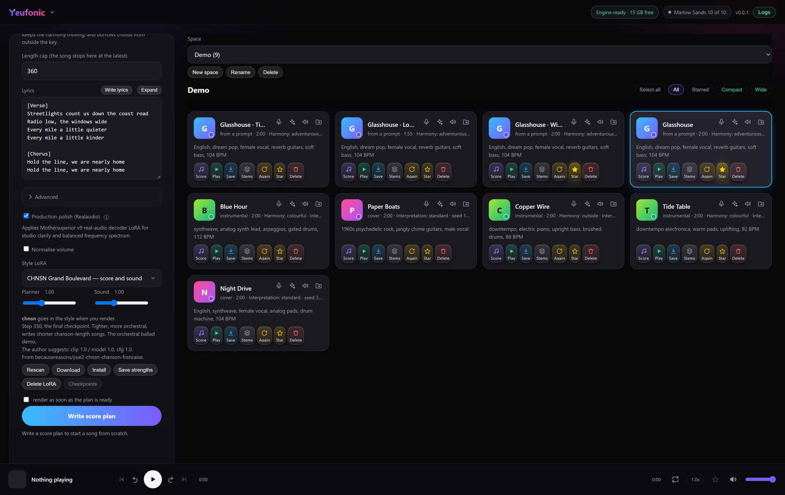
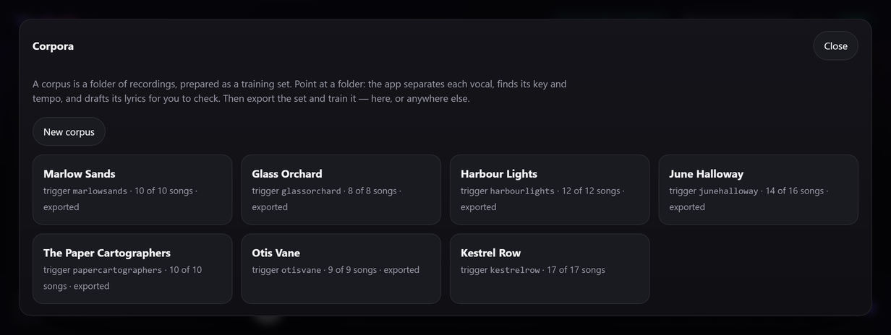
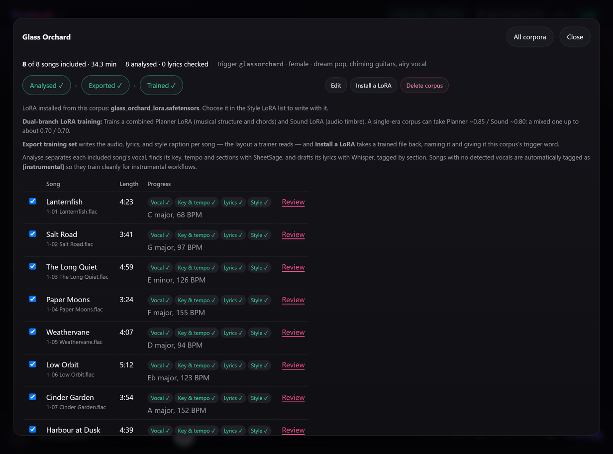

#  Yeufonic

> **YuE2 Studio is now Yeufonic.** It's the same app under a new name, with the version numbers
> starting again at 0.0.1. The old repository,
> [dynamohum/YuE2gen-studio](https://github.com/dynamohum/YuE2gen-studio), is archived and gets
> no more updates. If you use YuE2 Studio, your library, settings, LoRAs and models all come
> across: see [Moving from YuE2 Studio](#moving-from-yue2-studio).

A web interface for [YuE2](https://github.com/multimodal-art-projection/YuE), the open music
model. Write a song from a prompt, or cover your own recording. Edit the score either way,
then pull the stems out of the result.

- **Song from a prompt:** write a score plan from a style and lyrics, edit it, render it.
- **Cover a recording:** transcribe your song, change its melody and chords, render a new version.
- **Instrumentals:** build the structure section by section.
- **Style LoRAs:** use published ones, or train your own from a folder of songs.
- **Lyrics:** draft them from a sentence, or extract them from a recording.
- **Stems:** split any take into vocals, drums, bass and more.
- **A library:** spaces, stars, and every take's settings kept so it can be made again.
- **Windows without Docker:** an installer that sets it all up natively, for people who would
  rather not use Docker. [It is new, and being tested](#on-windows-without-docker).

Everything runs on one machine, in two parts: the app and the engine. With Docker they are two
containers; the Windows installer runs the same two natively. No cloud and no accounts; an
external LLM for lyrics is optional.

    browser  ->  app  (this project)                 http://localhost:8090
                   |
                   v
                 engine  (ComfyUI + the YuE2 nodes)  owns the GPU

If you want to buy me a beer, then please use [PayPal](https://paypal.me/dynamohums).

## What it looks like

Covering a recording, with the score editor open:

[](https://raw.githubusercontent.com/yeufonic/yeufonic/main/docs/screenshots/full/cover-a-recording.png)

The same library with **Wide** and **Comfy** on: the page fills the window, and the cards are
wider, with room for the full title. Hover over a card's settings or prompt to read all of it.
Compact cards are what you start with:

[](https://raw.githubusercontent.com/yeufonic/yeufonic/main/docs/screenshots/full/comfy-layout.png)

Writing a song from a prompt:

[](https://raw.githubusercontent.com/yeufonic/yeufonic/main/docs/screenshots/full/write-a-song.png)

Writing an instrumental, with the structure built section by section:

[](https://raw.githubusercontent.com/yeufonic/yeufonic/main/docs/screenshots/full/instrumental.png)

## What it does

- **Cover a recording.** Upload a song, transcribe it once, edit the melody and chords, render.
  The transcription is cached per recording, so re-rendering skips straight to the music.
- **Hear what the recording sings.** A cover needs lyrics. **Extract lyrics** separates the vocal,
  listens to it and lays the lines under the sections of the score. It is asked for rather than
  done every time, and it runs on the CPU, so a render is never held up by it. Expect a good draft
  rather than a transcript: against the real words of two songs, Whisper got 1.5 and 25 per cent
  wrong, the second where lead and backing vocals overlap. With an external LLM that accepts audio,
  such as Gemini, a setting lets it hear the words instead, with Whisper keeping the timing; on the
  same two songs Gemini got 1.5 and 23 per cent.
- **Song from a prompt.** Write a score plan from style and lyrics, read it, repair it, render it.
  A new plan costs seconds, so a bad melody is cheap to discard.
- **Choose how adventurous the chords are.** YuE2 tends to write one four-chord loop for a whole
  song. The Harmony slider, from Familiar to Outside, pushes the planner towards chords it has not
  just used, without breaking the song's structure.
- **Instrumentals.** A third mode: style and structure in, a song with no vocal out. Build the
  structure section by section, time each section, or let YuE2 decide.
- **Draft lyrics from a sentence.** Say what the song is about and pick a structure. Gemma 4
  writes a first draft in YuE2's section layout, on the same engine, or an external LLM if you
  set one up in Settings.
- **Choose the interpretation.** Six ways to render the same score, from Tight to Wide, and
  **Variations** renders one take in the others, so you can compare them by ear.
- **Choose the voice.** Chips set female, male or duet and a voice character. YuE2 has no vocal
  parameter, so the chips write into the style text, and the take keeps the choice.
- **Train a LoRA from your own songs.** Prepare a corpus from a folder of songs, by one artist,
  in one genre or by a few similar artists, and train a style LoRA from it. It shows most in a
  song from a prompt, where the LoRA writes the tune. See Training a LoRA below.
- **Hear every step of a LoRA's training.** A training run keeps a checkpoint every 50 steps.
  **Checkpoints** renders the same song once on each of them, with one seed, as takes named after
  their step. Each has its own taste in melody and structure, while keeping the style and sound
  the LoRA was trained on.
- **Lean on a style LoRA.** Drop other people's trained files into `models/loras/` and pick one
  from a list, with separate strengths for the score and the sound. See Style LoRAs below.
- **Read the score three ways.** Expand opens a full size editor, with the chord find and replace
  beside it, and three views below: a chord chart, real staff notation, and the lyrics with each
  section's chords. Chord symbols sit in double quotes. Fix one everywhere with find and
  replace, or edit any single chord by hand in the score.
- **Stems.** Extract vocals, drums, bass, other, and optionally guitar and piano, on CPU, while
  the GPU stays free. Download them singly or as a zip.
- **Spaces.** Keep takes apart by project: a space per song, per album, or for sketches. Create,
  rename and delete spaces, and move a take from one to another.
- **A library.** Every take keeps its score, style, lyrics, seed and settings, so it can be
  reproduced, reworked, starred or deleted. Tick several cards and one button clears them all,
  after naming what it is about to remove.
- **A player for reviewing takes.** A real waveform you can click to seek, previous and next through
  the library, ten second skips, repeat, speed and volume, with keyboard shortcuts.

## Style LoRAs

A LoRA is a small file that leans YuE2 towards a sound: a genre, a tradition, a production style.
Put one in `models/loras/` and press **Rescan**, or use **Install**, and it appears in the **Style
LoRA** list at the bottom of the form, in all three modes. **Download** hands one to someone else.

[](https://raw.githubusercontent.com/yeufonic/yeufonic/main/docs/screenshots/full/style-lora.png)

These are usually files other people have published, mostly on Hugging Face, and
the app's job is to make them usable without knowing how they are put together:

- **Two strengths, because a LoRA has two halves.** *Planner* shapes what is played: the score
  plan — form, harmony, phrasing — and then the music a render writes from it. *Sound* shapes the audio. A file that
  holds only one half has the other strength greyed out, and a file this engine cannot load is
  named as such in the list rather than failing quietly inside a render.
- **The trigger word is handled for you.** Most of these files do very little unless the style text
  starts with the word they were trained on. Choosing a LoRA puts its trigger at the front of the
  Style, switching swaps it, and None takes it away.
- **Each one says what it is.** The list is grouped by publisher, and every entry carries its
  author's own description and suggested strengths, on the option and in a tooltip. A LoRA of your
  own gets the same by writing a `.txt` beside it: first line the name, a `Trigger:` line, then the
  description.

The [user guide](app/static/guide.md#style-loras) has the detail, including what to do when a song
will not end.

## Training a LoRA

Open **Corpora** from the menu. The app prepares a **corpus**: a folder of songs. Typically this
would be of an artist or genre to use when training your LoRA. Each track gets its vocal
separated, its key, tempo and sections found and its lyrics drafted. You then export it as a
training set, and train a style LoRA from it. Training holds the GPU until it finishes, and the
LoRA appears in the Style LoRA list, with a style chip for each song it learned from. Training
also saves a checkpoint every 50 steps, listed under **Training checkpoints**. Each gives its own
take on the style. With the LoRA chosen, **Checkpoints** beside **Delete LoRA** makes what the
panel would make once on each of them, with one seed, so you can compare them by ear. To save the
space, **Training checkpoints** in Settings can delete them when training ends. To share a LoRA, press **Download** under the picker: the zip carries
its chips, and the other person adds it with **Install**.

Your corpora, one corpus per artist or genre:

[](https://raw.githubusercontent.com/yeufonic/yeufonic/main/docs/screenshots/full/corpora.png)

One corpus, analysed, exported and trained, with each song's key and tempo:

[](https://raw.githubusercontent.com/yeufonic/yeufonic/main/docs/screenshots/full/corpus.png)

It does most in a song from a prompt, where the LoRA writes the tune: Planner and Sound up to
about 0.70, with Plan variety Calm or Normal. In a cover your recording sets the melody, so keep
Sound near 0.50. The [user guide](app/static/guide.md#corpora-and-training-a-lora) walks
through it.

How many steps a run trains for, and how much it can learn, can be changed: see
[Environment variables](#training).

It is on by default. `TRAINING_ENABLED: "0"` on the app takes it out, and `WITH_TRAINER=0` leaves
the trainer out of the engine image.

## On Windows, without Docker

**A first version, being tested.** A small installer sets Yeufonic up natively on Windows.
It needs no Docker, no WSL and no administrator rights.

**You need:**

- Windows 10 22H2 or Windows 11, 64-bit.
- An NVIDIA graphics card, RTX 30-series or newer, with a recent driver. 12 GB of video memory is
  recommended, and 8 GB works. AMD and Intel graphics are not supported.
- 16 GB of RAM and about 40 GB of free disk.
- An internet connection for about 24 GB of downloads, most of it the models.

The installer checks all of this before it downloads anything.

**Installing:**

1. **Download** `Yeufonic-Setup-<version>.exe` from the
   [latest release](https://github.com/yeufonic/yeufonic/releases/latest).
2. **Run it.** The installer is not signed yet, so Windows may say *Windows protected your PC*.
   Choose *More info*, then *Run anyway*.
3. **Choose your options:**
   - Accept the terms.
   - Choose whether to include **Lyric drafts (Gemma 4)**. Leave it out if you will set up an
     external LLM; that saves an 8 GB download.
   - Keep or change the folder. The default is `%LOCALAPPDATA%\Programs\Yeufonic`.
4. **Wait for setup.** A setup window checks the PC, then downloads each part from its own
   publisher and checks it against its published checksum. The window may open behind the
   installer. If a download breaks off, run the installer again: it carries on from where it
   stopped.
5. **Start Yeufonic** from the Start menu or the desktop. A small window starts the engine and
   the app, then opens http://localhost:8090 in your browser. Closing that window stops them.

**Ports and folders:** a `settings.ini` in the install folder changes them. Create it with a
`[yue2]` section and only the lines you need, then start Yeufonic again:

```ini
[yue2]
app_port = 8090
engine_port = 8188
data_dir = D:\YuE2 library
import_roots = D:\Music
open_browser = yes
```

`data_dir` is where the library lives (by default, `data` in the install folder). `import_roots`
is the folders a corpus may be built from, separated by commas (by default, your user folder).
Other settings are environment variables: see [Environment variables](#environment-variables).

**Updating:** run a newer installer over the top. It says it is an update, keeps the models and
your library, and fetches only what has changed.

**Uninstalling:** use *Settings → Apps*. It asks two things:
- **Keep your library?** Your songs, takes, corpora and LoRAs. Yes unless you say otherwise.
- **Also keep the downloaded models?** It shows their size. No unless you say otherwise, so the
  space is freed.

Anything kept stays in the install folder, and installing again finds it there, so kept models
are not downloaded again. Deleting that folder removes it.

**If something goes wrong:**
- **Logs:** the `logs` folder inside the install folder holds `install.log`, `engine.log` and
  `app.log`.
- **Repair:** *Repair Yeufonic* in the Start menu runs the setup again.
- **Docker at the same time:** a Docker copy of Yeufonic uses the same ports and the same GPU,
  so stop one before starting the other.

## Requirements

- An NVIDIA GPU with 12 GB of VRAM or more is recommended, with 16 GB of system RAM. An 8 GB card
  is worth trying: ComfyUI moves what does not fit into system RAM, so it still works, though
  smaller cards are usually slower chips and renders take longer.
- Docker with the NVIDIA container toolkit, so containers can see the GPU.
- About 35 GB of disk: 15 GB of images, 17 GB of models, and room for your songs.
- Linux, or Windows with WSL2 or Docker Desktop. WSL2 is what this was built on; Windows with
  Docker Desktop needs a few settings, below. On Windows, [the installer](#on-windows-without-docker)
  needs none of this.

## Quick start

```sh
git clone https://github.com/yeufonic/yeufonic.git
cd yeufonic
sh scripts/fetch-models.sh          # about 17 GB, and creates the folders below
docker compose up -d --build
```

Then open <http://localhost:8090>.

### Build options

These need a rebuild rather than a setting.

| Build arg | Default | What it does |
|---|---|---|
| `WITH_TRAINER` | `1` | on the **engine** service. Builds in the LoRA trainer; `0` leaves it out, and Corpora is hidden. See Training a LoRA above |
| `FS_AUDIO_REF` | pinned commit | which commit of that pack to use, if it is included |
| `COMFYUI_REF` | pinned commit | which commit of ComfyUI the engine is built from. See Contributing for how far it has drifted |

They are set under `build: args:` in `compose.yml`, or passed on the command line:

```sh
docker compose build --build-arg WITH_TRAINER=0 engine
```

The fetch script also creates `data/` and `engine-state/output/`. Let it, rather than leaving them
to Docker: a folder Docker creates for a mount belongs to root, and the app, which runs as uid
1000, then cannot write its library there. If your user is not uid 1000, change `user:` for the
app in compose.yml to your `id -u`:`id -g`, or `chown` those two folders to 1000.

The models are YuE2 (plans and renders), SheetSage2 (transcription), Gemma 4 E4B (lyric drafts),
the YuE2 instrumental LoRA, and the Realaudio decoder LoRA and tokenizer head.

Only localhost is published, and **there is no login**: anyone who can reach the port can use the
app. To reach it from other machines, put it behind something that authenticates, and add the
name or address you use to `ALLOWED_HOSTS` in compose.yml, or the app refuses the request. See
Other ways to run it below.

### Windows with Docker Desktop

Docker Desktop runs the containers in the same WSL2 Linux system as WSL itself, so the app runs
the same way. The setup around it needs care:

1. **Use the WSL 2 engine.** In Docker Desktop, *Settings → General → Use the WSL 2 based engine*
   must be on. The older Hyper-V engine cannot reach the GPU.
2. **Turn on WSL integration** for your distribution, in *Settings → Resources → WSL
   Integration*, then open a new terminal. Without it, `docker` in a WSL terminal cannot see
   Desktop's daemon. If Docker is also installed inside WSL, `docker info --format
   '{{.OperatingSystem}}'` says which one you are talking to: Docker Desktop names itself, the
   other names the distribution.
3. **Install a current NVIDIA driver** for Windows. It includes WSL support; nothing is installed
   inside Linux. Check with `docker run --rm --gpus all nvidia/cuda:12.8.0-base-ubuntu24.04 nvidia-smi`,
   which should print the card.
4. **Give WSL enough memory.** It is capped at part of the PC's RAM, and a render needs about
   11 GB. Create `%UserProfile%\.wslconfig` with:

   ```ini
   [wsl2]
   memory=14GB
   ```

   Set it to your RAM less 2 GB, then run `wsl --shutdown` and start Docker Desktop again.
5. **Clone inside WSL, not on C:.** Open a WSL terminal (Ubuntu from the Store is the usual one)
   and run the quick start there. A clone on `C:\` works, but the 17 GB of models and the library
   then cross a slow bridge into Linux, and SQLite's locking is less dependable across it.
6. **Run the fetch script in that WSL terminal**, or in Git Bash. PowerShell and Command Prompt
   cannot run `sh`.

The repository forces Unix line endings, so a clone on Windows keeps its scripts runnable. If
`sh scripts/fetch-models.sh` still reports `$'\r': command not found`, the clone was made with a
setting that overrides it: clone again from the WSL terminal.

## Updating

```sh
git pull
docker compose up -d --build
```

The database migrates itself on the first start. Read the release notes for anything to do by
hand, such as a new setting in `compose.yml`.

## Moving from YuE2 Studio

Yeufonic is YuE2 Studio renamed, so your library, settings, LoRAs and models come across as
they are.

**On Windows,** run the Yeufonic installer. It finds YuE2 Studio and updates it where it is,
in its own folder, and replaces its shortcuts and Apps list entry with Yeufonic ones. Nothing is
downloaded again except what has changed.

**With Docker,** clone Yeufonic beside your YuE2 Studio folder and move your things across:

```sh
cd YuE2gen-studio && docker compose down && cd ..
git clone https://github.com/yeufonic/yeufonic.git
cd yeufonic
sh scripts/migrate-from-yue2studio.sh ../YuE2gen-studio
docker compose up
```

The script moves `data/`, `models/`, `engine-state/` and your `compose.override.yml`. It reuses
the engine image rather than building it again. Once Yeufonic has started with your library,
the YuE2 Studio folder can be deleted.

## Using it

The **[user guide](app/static/guide.md)** covers everything the app does, organised by what you are
trying to do: writing a song, covering a recording, instrumentals, voices, style
LoRAs, stems, the library and what to do when something is wrong.

It is also in the app itself, under the menu in the top left, or at
<http://localhost:8090/guide> — which is where it is most useful, since trigger words and LoRA
strengths are things you need while filling the form.

How it is built — the two containers, how the app drives ComfyUI, what YuE2 does inside it, the
LLMs and the API, with diagrams — is in **[docs/ARCHITECTURE.md](docs/ARCHITECTURE.md)**.

## Settings

Press **Yeufonic** in the top left. The settings are stored on the server, so they follow you to
any browser and survive a rebuild.

| Setting | What it does |
|---|---|
| Output audio format | FLAC (the default), WAV, or MP3 at 320 kbps. The format stems and a take's **Save** start with; each can choose another at the time |
| Stem separation model | Which model a run starts with |
| Stem save folder | Where stems are written. It must sit inside the data folder |
| Training checkpoints | Keep them, listed under Training checkpoints (the default), or delete them when training ends |

A settings sheet is generated from a specification on the server, so a new setting is a
server-side change only.

## Things worth knowing about YuE2

- **Both nodes must be on `full` mode to keep a chord progression.** SheetSage2's `melody` mode
  strips chord symbols, and YuE2 then invents its own harmony. `melody` is only better when you
  want the accompaniment to follow a new style freely.
- **Bracket tags in the lyrics box steer the model and are not sung.** `[Genre: ...]` and
  `[Chorus: bigger]` go into the conditioning. Measured: adding `[Genre: Indie Folk, Chamber
  Pop]` moved a plan from E minor to E flat and changed the chords, while the melody gained no
  notes for the tag's syllables.
- **Duration is a cap, not a target.** `max_duration` truncates; it never stretches. The real
  length comes from the score: bars x beats per bar x 60 / tempo predicted the finished render
  within about 5 per cent across six takes. The app shows that estimate under the score.
- **A score writer will happily loop four bars for a whole song.** Use *Harmony* for the chords
  and *Plan variety* for the melody and structure, or fix the harmony by hand.
- **Plan variety is mostly the repetition penalty.** It pushes against every recently used token,
  chords and melody notes alike. Temperature matters little between 0.55 and 1.0. Measured on
  plans alone (8 per step, two invented songs):
  - **Calm to bold:** the chord vocabulary grows about threefold while the melody stays within two
    octaves.
  - **At a penalty of 1.08** (*quirky* and *wild*): the melody spans up to five octaves and jumps
    register between sections. *Wild* changes key about twice a song.
  - **Too much breaks the score:** the voice headers are tokens too. An older *wild* (temperature
    1.25, penalty 1.18) broke 6 of 6 test plans.

  A plan that does come out unreadable is marked failed, with a reason, instead of being stored
  and rendered.
- **The models have their own licences**, separate from this code. See License below.

## Layout

```
compose.yml            engine + app, the one machine setup
compose.override.yml.example
                       your own settings and music mounts: copy it to
                       compose.override.yml, which is git-ignored
engine/Dockerfile      ComfyUI pinned to the commit this was built against, and the
                       WITH_TRAINER build arg, on, that builds the trainer in
engine/custom_nodes/   yue2_harmony, the node behind the Harmony slider
Dockerfile             the app: FastAPI, one static page, demucs
app/                   the application
  main.py              the HTTP API
  jobs.py              the GPU and stem job lanes: submit, wait, cancel, collect
  lyrics.py            the lyric prompt, and tidying what the model writes
  engine.py            the ComfyUI client, progress relay, template validation
  db.py                SQLite: connection per thread, numbered migrations, settings
  library.py           the data folder: names, take.json, durations, waveform peaks
  stems.py             demucs
  config.py            settings read from the environment
  templates/           API-format graphs: transcribe, song_plan, render
  static/              the page. No build step
tests/                 pytest: the API, the job lanes against a fake engine, migrations
scripts/fetch-models.sh
scripts/check-upstream.sh   how far ComfyUI, the trainer and the model repositories have moved
models/                bind mounted into the engine (git ignored)
data/                  your library: sources, takes, stems, SQLite (git ignored)
engine-state/          ComfyUI's input, output and user folders (git ignored)
tools/ui-harness.mjs   drives the real app.js against a running instance, with a stub DOM
tools/git-hooks/       the pre-push hook that keeps top-level PDFs off GitHub
requirements-dev.txt   the app's packages plus pytest
eslint.config.mjs      lint rules for app.js
```

## Where files live

The data folder names things after what they hold, so it reads without the database.

```
data/
  yue2.sqlite                                    everything the app knows
  sources/f72ac22518a9ea05-modern-girl.wav       your upload, hash first, then its name
  sources/f72ac22518a9ea05-modern-girl.vocals.flac  its vocal, kept once lyrics are extracted
  takes/modern-girl-take1-329e420d5990/
    modern-girl-take1.flac                       the rendered audio
    modern-girl-take1.peaks.json                 the waveform the player draws, cached
    take.json                                    title, style, lyrics, seed, score, date
  stems/hippie-doodling2-3f35c4d3c286/
    vocals.wav  drums.wav  bass.wav  other.wav
  models/torch/                                  demucs weights, downloaded on first use
  tmp/                                           work in progress, emptied on every start
```

A folder name ends with the take's id, which keeps two takes of the same name apart.
`take.json` holds the seed and the date the card shows, so a folder copied out of the library
still says where it came from.

## Backups

Everything that matters is under `data/`: the uploaded sources, the rendered takes, the stems
and the database. Copy that folder and you have the library. Scores and settings live in the
database, so a take is reproducible from it.

`data/tmp/` and `data/models/` can be left out: one is emptied on start and the other downloads
again. So can the `*.peaks.json` files, which are rebuilt when a take is played, and the
`*.vocals.flac` beside recordings, which are separated again the next time lyrics are extracted. Copy the database
while the app is stopped, or with `sqlite3 data/yue2.sqlite ".backup backup.sqlite"`, so the copy
is consistent.

## Other ways to run it

The app and the engine are separate services that talk over HTTP and WebSocket, so they do not
have to sit on the same machine. `ENGINE_URL` is the only setting that matters.

- **One machine** (this file): simplest, and what the quick start does.
- **App on a NAS, engine on the GPU box**: keeps the library and the UI always on, even when the
  rendering machine sleeps. Use `compose.split.yml` for the app. On the GPU box, publish the
  engine's port on the LAN rather than on 127.0.0.1, and set `ENGINE_URL` to it. Set
  `ALLOWED_HOSTS` to the names you reach the NAS by.
- **Docker Desktop on Windows**: works, with the settings in *Windows with Docker Desktop*
  above. It publishes ports onto the Windows host, so other devices can reach the UI once
  `ALLOWED_HOSTS` names them.
- **Native Linux, no containers**: install ComfyUI with the YuE2 nodes and point `ENGINE_URL` at
  it. Install `requirements.txt`, ffmpeg and demucs, then run the app from the repository with
  `DATA_DIR=./data VERSION_FILE=./VERSION uvicorn app.main:app --port 8090`. Without those two
  variables the app looks for `/data` and shows its version as unknown.

Whichever you choose, the app checks the engine every two seconds, and starts without it. A
missing node or model shows in the header instead of failing a render.

## Environment variables

Settings that are not in the app's Settings panel. With Docker, add them under the **app**
service's `environment:` in `compose.override.yml`, which updates never overwrite, and restart.
The easiest start is the example, which has every setting below commented out, with a line on
each, and examples of mounting your music:

```sh
cp compose.override.yml.example compose.override.yml
```

Then uncomment what you need. A setting on its own looks like this:

```yaml
services:
  app:
    environment:
      TRAIN_MIN_STEPS: "600"
```

Values are read once, at start.

**On Windows, without Docker,** they are ordinary Windows environment variables:

1. Close Yeufonic's window, which stops it.
2. Open Start, type *environment*, and choose **Edit environment variables for your account**.
3. Under *User variables*, press **New**. Enter the name, say `TRAIN_MIN_STEPS`, and the
   value, say `600`, then **OK** twice.
4. Start Yeufonic again from the Start menu or the desktop.

Or in PowerShell, `setx TRAIN_MIN_STEPS 600`, then start Yeufonic. To go back to the default,
delete the variable. The Windows install sets the library folder, the folders a corpus may be
built from, and the ports itself: change those in its `settings.ini` instead (see
[On Windows, without Docker](#on-windows-without-docker)). `ENGINE_URL`, `ENGINE_OUTPUT_DIR` and
`TRAINING_ENABLED` are fixed there.

### The app

| Variable | Default | What it does |
|---|---|---|
| `IMPORT_ROOTS` | `/import` | folders a corpus may be built from, comma-separated, as paths inside the container. Each needs a read-only volume mount; `compose.override.yml.example` has examples. `./data/corpus` is always offered |
| `ALLOWED_HOSTS` | `localhost,127.0.0.1,::1` | host names the page may be reached by. Add a LAN name or address when you publish the port; `*` turns the check off |
| `ENGINE_URL` | `http://127.0.0.1:8188` | where ComfyUI answers. Change it when the engine runs on another machine |
| `ENGINE_OUTPUT_DIR` | unset | the engine's output folder, mounted into the app. Renders are removed from it once the app has its copy |
| `MAX_UPLOAD_MB` | `2048` | the largest recording you can upload, in megabytes. The engine has its own ceiling, `ENGINE_MAX_UPLOAD_MB` on the engine service, set to the same figure: raise both together |
| `STEMS_THREADS` | half the CPUs | torch threads for the separation |
| `STEMS_JOBS` | 4, or a quarter of the CPUs | demucs segments applied at once. One uses about 1.8 GB and 2.5x realtime, four uses 3.7 GB and 3.6x. The split setup's 2 GB cap needs this at 1, or the cap raised |
| `WEAK_RENDER_DB` | `-24` | the average level, in dB, below which a take is marked *Weak render* |
| `TRAINING_ENABLED` | `1` | corpora and LoRA training; `0` takes them out of the app. Training also needs `WITH_TRAINER` on the engine. See Training a LoRA |
| `DATA_DIR` | `/data` | the library. Only needed when running without the containers |

### Training

How long a run trains and how much it can learn. A **step** trains on two songs; a **pass** has
seen every song in the corpus once. Longer runs fit the corpus more closely, and past a point
copy it rather than its style. The checkpoints are kept, so a run that went too far can be
heard back to an earlier step with **Checkpoints**.

| Variable | Default | What it does |
|---|---|---|
| `TRAIN_MIN_STEPS` | `500` | the fewest steps a run gets. Small corpora need the floor: ten passes over 14 songs is only 150 steps |
| `TRAIN_PASSES` | `10` | passes over each song. A corpus big enough for more steps than the floor gets these: 60 songs gives 600 |
| `TRAIN_STEPS` | unset | a fixed step count for every run, in place of the two above |
| `TRAIN_CHECKPOINT_EVERY` | `50` | steps between the checkpoints a run saves |
| `TRAIN_MAX_MINUTES` | `3.5` | how much of each song is trained on, from its start, in minutes. Preparing a song for training holds it whole on the GPU, so the longest a card can take depends on its memory: about 6 minutes on 16 GB. Raise `TRAIN_MAX_TOKENS` with it |
| `TRAIN_MAX_TOKENS` | `8192` | the Planner's context: it learns each song whole, as one sequence, and leaves out any song too long for it. 8192 holds songs to about 5 minutes; for longer, use `12288` (with `TRAIN_MAX_MINUTES` of `5.5`, for example). It costs little in itself: time and memory follow the songs' real length |
| `TRAIN_RANK_PLANNER` | `64` | how much the Planner half, which shapes the melody and structure, can hold. Higher can capture more, and makes a bigger file that overfits more easily |
| `TRAIN_RANK_DECODER` | `32` | the same for the Sound half |
| `TRAIN_DECODER_STEPS` | `1000` | steps for the Sound half, whatever the corpus size |

## Troubleshooting

| Symptom | Cause | Fix |
|---|---|---|
| Header says *Engine offline* | the engine container is not running | `docker compose up -d engine`, then read `docker compose logs engine` |
| Header names a missing node | ComfyUI was updated and a node was renamed | check `app/templates/*.json` against `/object_info` |
| torchaudio fails to load its extension | torch, torchvision and torchaudio drifted apart | they are pinned together in both Dockerfiles; keep it that way |
| `docker compose build` hangs with no output | the buildx plugin is missing | install `docker-buildx` for your Docker |
| Engine runs but sees no GPU | the container has no GPU access | `docker run --rm --gpus all nvidia/cuda:12.8.0-base-ubuntu24.04 nvidia-smi` should print the card |
| Render fails out of memory | another program is using the GPU | close other GPU work; see Requirements |
| **Write score plan** is greyed out in Instrumental | the LoRA is not in `models/loras` | `sh scripts/fetch-models.sh`, then `docker compose restart engine` |
| **Write lyrics** is greyed out | Gemma is not in `models/text_encoders` | `sh scripts/fetch-models.sh`, then `docker compose restart engine` |
| **Corpora** is not in the menu | `TRAINING_ENABLED` is `0`, or the engine was built with `WITH_TRAINER=0` | set both back to `1`, rebuild the engine if it was the second; see Training a LoRA above |
| Header says the checkpoint is missing | `yue2_3b_bf16.safetensors` is not in `models/checkpoints` | `sh scripts/fetch-models.sh`, then `docker compose restart engine` |
| **Render this score** and **Write a new plan** are greyed out | no take's score is in the editor | press **Score** on a take in the library, or write a plan |
| The app restarts, and its log says it cannot open the database | `data/` belongs to root, because Docker created it | `sudo chown -R 1000:1000 data engine-state/output`, or the uid in compose.yml |
| The page says *This host name is not allowed* | you reached it by a name not in `ALLOWED_HOSTS` | add that name or address to `ALLOWED_HOSTS` in compose.yml |
| The Harmony slider is greyed out | the engine image is older than the app and has no `yue2_harmony` node | `docker compose up -d --build engine` |

## Contributing

Working on the code, rather than running it? [CONTRIBUTING.md](CONTRIBUTING.md) has the
branch and test-instance workflow, the checks to run, the engine pin and how a release is
cut.

## Credits

- YuE2 by HKUST M-A-P. Weights CC BY-NC 4.0.
- SheetSage2 and MERT2 by the same team, for transcription.
- [YuE2 instrumental LoRA](https://huggingface.co/Mothersuperior/YuE2-instrumental-cot-full-loras) by
  Mothersuperior, for instrumentals. CC BY-NC 4.0.
- [Gemma 4](https://huggingface.co/Comfy-Org/gemma-4) by Google, for lyric drafts. Apache 2.0.
- [ComfyUI](https://github.com/comfyanonymous/ComfyUI) as the engine.
- [Demucs](https://github.com/facebookresearch/demucs) by Meta for stems. MIT.
- [abcjs](https://github.com/paulrosen/abcjs) by Paul Rosen and Gregory Dyke, for staff notation.
  MIT, vendored in `app/static/` so it works offline.

## License

The code in this repository is licensed under the [Apache License 2.0](LICENSE).

The models it runs are not part of the repository and carry their own terms, listed in
[THIRD_PARTY_NOTICES.md](THIRD_PARTY_NOTICES.md). The one that matters most for musicians: YuE2's
weights are CC BY-NC 4.0 with an additional creator permission, under which personal users,
content creators and musicians may monetise the music they generate, with no fees or royalties
to the YuE2 authors. Commercial companies need a licence from them. Read the notices for the
details, including the instrumental LoRA, whose author has not said anything about monetising
its output.
